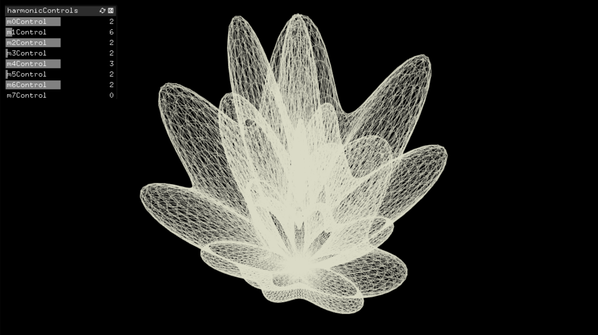
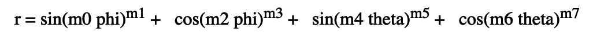

# SphericalHarmonics

Implementation of Spherical Harmonics in openframeworks using [Paul Bourke formula](http://paulbourke.net/geometry/sphericalh/).


- - - -

- - - -
## Getting Started

This repo is a quick research around organic shapes in [openframeworks](https://openframeworks.cc/).
It is coded in openframeworks and generates abstract graphics, using the 8 parameters of this formula:



The [PB_sphericalh folder](PB_sphericalh/) should be put in the ``` OF_rootFolder/apps/myApps/ ``` folder.

To run it (only on MacOS):
* Download Openframeworks from [here](https://openframeworks.cc/download/),
* Follow [those steps](https://openframeworks.cc/setup/xcode/) to get started,
* Open the PB_sphericalh.xcodeproj in xcode then run it.
- - - -
### Built With

#### OpenFrameworks

* Openframeworks 0.10.1 on  [MAC OS](https://openframeworks.cc/download/)
